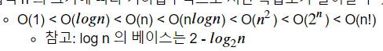
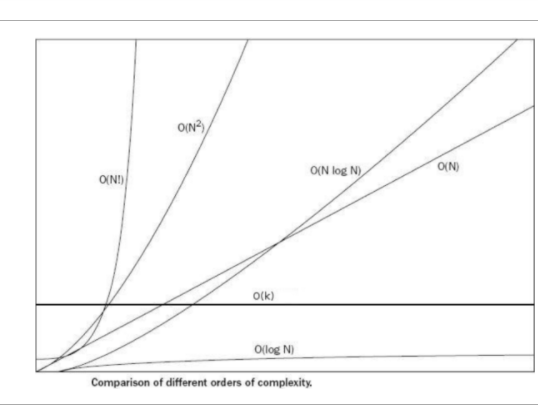

## 알고리즘 성능 
 1. 시간 복잡도 : 알고리즘 실행 속도        
    * 반복문에 의해 지배된다.
    * 입력값이 커지면 반복문이 커지므로 시간 복잡도도 커진다.
    

 2. 공간 복잡도 : 알고리즘이 사용하는 메모리 사이즈

## 알고리즘 성능 표기법
* 빅-오 표기법

  최악의 실행 시간 표기     
  가장 많이 사용된다.  
  아무리 최악의 상황이라도 이정도의 성능은 보장한다는 의미       
  
  
* 오메가 표기법      
최상의 실행시간을 표기   
 
 
* 세타 표기법     
평균 실행시간을 표기     
  
## 대문자 O 빅오 표기법
   

## 1부터 n까지 합을 구하는 알고리즘
    int sum = 0;
    for(int i = 1; i<=n;i++)
        sum += i;
    return sum;
여기서는 반복문이 한개 -> 시간 복잡도는 n이 된다. O(n)
    
    n(n+1) / 2 -> 이것도 1~n을 합하는 식
    -->
    public int sum(n){
        return n(n+1)/2
    }
이렇게되면 시간복잡도는 1이 된다.

즉 같은 문제더라도 푸는 방법에 따라서 시간 복잡도가 달라진다.
    